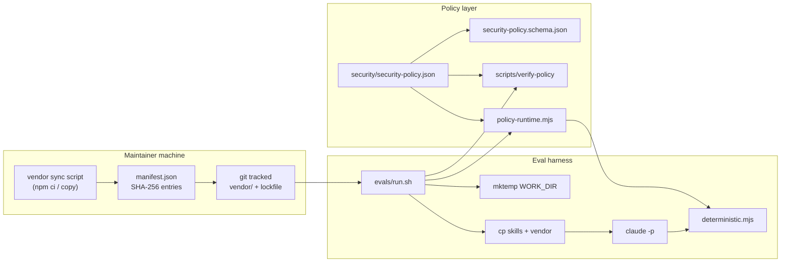

# Phase 6: Offline vendoring & dual-mode HTML - Research

**Researched:** 2026-04-29  
**Domain:** Static HTML viewer assets, integrity manifests, JSON policy extension, Bash eval harness  
**Confidence:** MEDIUM (policy/HTML grounded in repo; Tailwind/Shiki packaging tradeoffs mix registry verification and documented patterns)

## Summary

Phase 6 delivers a **frozen vendor tree**, an **integrity manifest**, and **granular policy keys** so `policy-runtime.mjs`, `evals/run.sh`, `html-patterns.md`, and `deterministic.mjs` share one contract for **CDN vs vendor** dual mode. The repo today wires viewer scripts exclusively via public CDNs in `skills/walkthrough/references/html-patterns.md` [VERIFIED: repo file], while `evals/graders/deterministic.mjs` Tier 2 checks hard-code CDN substring markers [VERIFIED: repo file]. Extension must replace that coupling with **policy-driven** expectations and **fail-closed** preflight when vendor mode is required but files or hashes are wrong (**D-04**, OFF-06).

**Tailwind** offline is intentionally left to planner discretion (**D-01**): the smallest maintainable path is usually a **precompiled CSS artifact** plus the existing inline `tailwind.config` block for custom `wt-*` tokens [VERIFIED: `html-patterns.md` Tailwind Config Block], avoiding a runtime JIT dependency on `cdn.tailwindcss.com`. **Shiki** (**D-02**) should vendor the **ESM package graph** (including WASM/onig assets) at a pinned major aligned with `createHighlighter` / `vitesse-dark` usage [VERIFIED: `html-patterns.md` Complete Script Block Order]; upgrading from the reference’s **3.22.0** CDN pin to current npm **shiki** requires explicit compatibility testing [VERIFIED: npm registry API — see Standard Stack].

**Primary recommendation:** Introduce `vendor/walkthrough-viewer/` (single vendor root), `vendor/walkthrough-viewer/manifest.json` (SHA-256–indexed entries), extend **`security/security-policy.schema.json`** with a new explicit top-level object (schema uses `additionalProperties: false` [VERIFIED: `security/security-policy.schema.json`]) for **per-asset** `assetSource` / paths, implement **policy-runtime** resolution + manifest verification helpers, then **`evals/run.sh`**: after existing `scripts/verify-policy` [VERIFIED: `evals/run.sh` lines 44–48], add vendor preflight + recursive copy of the vendor tree into `WORK_DIR` before `claude -p`. Finally, align **`deterministic.mjs`** Tier 2 with effective modes instead of CDN-only strings. **Implementation order:** policy schema + manifest format first, then runtime helpers, then harness copy + fail-closed checks, then grader + `html-patterns.md` parity (see Integration order).

## Architectural Responsibility Map

| Capability | Primary Tier | Secondary Tier | Rationale |
|------------|--------------|----------------|-----------|
| Integrity manifest & hashing | Repo / maintainer toolchain | CDN / Static | Bytes live in git; hashing is offline verification |
| Policy keys & precedence | Declarative JSON + validator | API / Backend — | No server; schema + `validatePolicyDocument` [VERIFIED: `security/policy-runtime.mjs`] |
| Effective CDN vs vendor resolution | Node (`policy-runtime.mjs`) | Browser — | Graders and shell read policy; HTML is emitted output |
| Eval temp workspace vendor copy | Bash (`evals/run.sh`) | Node guards | `mktemp` + `cp` mirror skill copy pattern [VERIFIED: `evals/run.sh`] |
| Generated HTML script URLs | Browser / Static artifact | Policy-informed generation | Skill output must match declared mode |

<user_constraints>
## User Constraints (from CONTEXT.md)

### Locked Decisions

- **D-03:** Use **granular policy keys per asset class** (e.g. separate knobs or sources for React/Mermaid/Tailwind/Shiki bundles), **not** only a single global `walkthroughAssetMode`. Graders and `policy-runtime.mjs` must still resolve an effective mode consistently — document precedence rules when implementing.

- **D-04:** **Strict fail-closed** when policy requires vendor mode but vendor tree or integrity manifest is missing or invalid: **no silent fallback to CDN fetch**; `evals/run.sh` / preflight should exit non-zero. Align messaging with existing egress/redaction posture.

### Claude's Discretion

- **D-01:** Tailwind offline strategy — choose the smallest maintainable path that satisfies OFF requirements (likely precompiled CSS or equivalent static artifact vs Play CDN in vendor mode).

- **D-02:** Shiki vendor/offline path — balance full fidelity (`vitesse-dark`, ESM graph, WASM) vs staged subset; planner MUST align `html-patterns.md` contract with whatever subset is chosen.

### Deferred Ideas (OUT OF SCOPE)

- **None** — discussion stayed within Phase 6 scope.

### Implementation notes from CONTEXT (canonical)

- Phase boundary: **ADV-01 / OFF-01..OFF-06**; does **not** implement signed provenance (Phase 8) or cross-platform sandbox depth (Phase 7).
- Git hygiene: introducing `package-lock.json` / npm vendor sync touches repo hygiene — align with OFF-03 reproducibility.

</user_constraints>

<phase_requirements>
## Phase Requirements

| ID | Description | Research Support |
|----|-------------|------------------|
| OFF-01 | Offline-capable eval/workflows without live CDN when policy requires vendor | Dual-mode policy + vendor tree + run.sh copy + no CDN fallback when vendor required |
| OFF-02 | Frozen vendor layout + integrity manifest | Recommended tree + `manifest.json` SHA-256 entries; tracked paths |
| OFF-03 | Reproduce vendor tree with pinned tooling | `npm ci` / lockfile + documented sync script; versions verified via registry API |
| OFF-04 | Policy + schema express asset mode and vendor roots; runtime + graders share truth | Extend `security-policy.schema.json`; helpers in `policy-runtime.mjs`; single JSON source |
| OFF-05 | `html-patterns.md` + deterministic grader aligned on relative vendor vs CDN | Replace Tier 2 CDN-only checks with policy-aware checks |
| OFF-06 | `run.sh` includes vendored assets; fail-closed if missing/mismatch | Copy after preflight; manifest verify; exit non-zero |

</phase_requirements>

## Project Constraints (from .cursor/rules/)

**None —** `.cursor/rules/` is not present in this workspace; follow `AGENTS.md`, `CONVENTIONS.md`, and repository `security/` contracts.

## Standard Stack

### Core

| Library | Version | Purpose | Why Standard |
|---------|---------|---------|----------------|
| shiki | **4.0.2** | ESM highlighter (`createHighlighter`, themes, langs) | Matches current npm `latest`; upgrade path from CDN **3.22.0** in reference [VERIFIED: npm registry API; reference pins 3.22.0 in `html-patterns.md`] |
| react / react-dom | **19.2.5** (npm latest) | UMD globals for viewer | [VERIFIED: npm registry API] — **note:** `html-patterns.md` documents React **18** UMD URLs; pin **18.x** in vendor layout for behavioral parity unless skill explicitly upgrades [ASSUMED: lock to 18.x for parity] |
| mermaid | **11.14.0** | Diagram runtime | Aligns with grader `mermaid@11` check [VERIFIED: `deterministic.mjs` + npm registry API] |
| tailwindcss | **4.2.4** | Maintainer-time CSS build (if CLI used) | [VERIFIED: npm registry API] — offline **delivery** in HTML is likely **static CSS file**, not full CLI at viewer runtime (**D-01**) |

### Supporting

| Library / artifact | Version | Purpose | When to Use |
|--------------------|---------|---------|-------------|
| `@shikijs/*` transitive | matches shiki lock | WASM / grammar bundles | Vendoring Shiki ESM offline |
| Precompiled `walkthrough-viewer.css` | n/a (built artifact) | Tailwind utilities + `wt-*` | Vendor mode without Play CDN |

### Alternatives Considered

| Instead of | Could Use | Tradeoff |
|------------|-----------|----------|
| Per-package dirs under one vendor root | Flat `vendor/` with hashed filenames | Flat is cache-friendly but harder for humans; nested mirrors npm mental model |
| Single global asset flag | Granular keys (**D-03**) | Global flag forbidden by decision; must implement precedence |

**Installation (maintainer sync — illustrative):**

```bash
# Define package.json + lockfile at repo root for reproducibility (OFF-03)
npm install
```

**Version verification:** Executed `curl https://registry.npmjs.org/<pkg>/latest` and parsed `version` [VERIFIED: npm registry API]. Local `npm view` failed with **E401** in this environment; public registry API succeeded.

## Architecture Patterns

### System Architecture Diagram



### Recommended project structure (repository root)

```
vendor/
└── walkthrough-viewer/
    manifest.json              # integrity: logical id → rel path + sha256 (+ optional size)
    README.md                  # how to regenerate (OFF-03)
    umd/                       # React / ReactDOM / Mermaid as consumed today (script tags)
    css/                       # tailwind-offline.css (or equivalent static bundle) — D-01
    shiki-pkg/                 # vendored npm layout for ESM import (see Shiki section)
```

**Naming rationale:** Single root **`vendor/walkthrough-viewer/`** keeps paths stable for policy (`vendorRoots`) and for `run.sh` (`cp -R`). Avoid scattering assets under `skills/` so skill content stays authoritative for *behavior*, not third-party bytes.

### Pattern 1: Integrity manifest (hash strategy)

**What:** One JSON manifest listing every byte-bearing file under the vendor subtree with **SHA-256** hex digests (same family as `artifactSha256` in `html-patterns.md` sidecars [VERIFIED: Artifact integrity sidecar section]).

**When to use:** OFF-02 / fail-closed verification before eval and optionally in CI.

**Example:**

```json
{
  "manifestVersion": 1,
  "algorithm": "sha256",
  "baseDir": ".",
  "entries": [
    { "id": "tailwind-css", "path": "css/walkthrough-viewer.css", "sha256": "…" },
    { "id": "shiki-esm-index", "path": "shiki-pkg/dist/index.mjs", "sha256": "…" }
  ]
}
```

**Source:** Pattern aligned with existing **SHA-256** sidecar concept [VERIFIED: `html-patterns.md`]; schema is project-defined.

### Pattern 2: Policy schema extension (per-asset keys)

**What:** Add a **new top-level property** on `security-policy.json` (e.g. `walkthroughViewerAssets`) because the root schema sets **`"additionalProperties": false`** [VERIFIED: `security/security-policy.schema.json`]. Under it, define:

- **`defaults`**: `{ "assetSource": "cdn" | "vendor" }` (or separate booleans — pick one enum style and stick to it).
- **Per-package overrides**: e.g. `packages.tailwind`, `packages.shiki`, `packages.react`, `packages.reactDom`, `packages.mermaid` each with `{ "assetSource", "vendorRelPath?" }`.

**Precedence (recommended):** `packages.<name>.assetSource` → else `defaults.assetSource`. Document explicitly in policy comments and in planner tasks (**D-03**).

**When to use:** OFF-04; consumed by `policy-runtime.mjs` and graders.

### Pattern 3: Dual-mode HTML contract

**What:** `html-patterns.md` documents **two** canonical snippets: **CDN** (current) and **vendor-relative** (paths under `./vendor/walkthrough-viewer/...` or agreed prefix). Generated HTML must use **one** mode consistently per build, matching resolved policy.

**When to use:** OFF-05; skill updates so Claude emits correct URLs in each mode.

### Anti-Patterns to Avoid

- **Silent CDN fallback** when `assetSource` is `vendor` — violates **D-04**.
- **Hard-coding vendor paths** only in graders — causes OFF-04 drift; graders must read effective config via shared helper or duplicated policy load consistent with `deterministic.mjs` imports of `policy-runtime.mjs` [VERIFIED: `deterministic.mjs`].
- **Extending policy without schema** — `validatePolicyDocument` will reject unknown keys if `additionalProperties` is false at repo root [VERIFIED: `security/validate-policy.mjs` + schema].

## Don't Hand-Roll

| Problem | Don't Build | Use Instead | Why |
|---------|-------------|-------------|-----|
| JSON policy validation | Ad-hoc checks | Extend `security-policy.schema.json` + `validatePolicyDocument` [VERIFIED: codebase] | Single validator already gates load |
| SHA-256 file hashing | Eyeballing file mtimes | Node `crypto.createHash('sha256')` streaming files | Stable, standard |
| ESM import maps for dozens of subpaths | Giant hand-maintained map | Vendored package tree preserving package `exports` or documented entry chunk | Shiki resolution is easy to break |

**Key insight:** The fragile layer is **browser ESM resolution + WASM paths** for Shiki — prefer a vendored layout proven to load with **relative imports** from the generated HTML’s module script.

## Tailwind offline options (tradeoffs)

| Option | What you ship | Pros | Cons |
|--------|----------------|------|------|
| **A. Precompiled CSS** | Single (or few) `.css` files with utilities needed for walkthrough patterns | No runtime JS; smallest offline surface; matches “no bundler for generated HTML” posture [VERIFIED: CONTEXT **Established Patterns**] | Changing Tailwind content requires **maintainer rebuild** |
| **B. Self-hosted Tailwind “Play” script** | Large runtime chunk emulating Play CDN | Close to current `cdn.tailwindcss.com` + inline config pattern | Heavier; still JS at runtime; version coupling |
| **C. Full Tailwind CLI in CI only** | Same as A; CLI not in viewer | Clean separation | Requires documenting build script |

**Recommendation for planners (**D-01**):** **Option A** — check in **`css/walkthrough-viewer.css`** generated from a small Tailwind input that includes the **`wt-*`** and `node-*` color extensions from `html-patterns.md` [VERIFIED: color tables]. Replace `<script src="https://cdn.tailwindcss.com">` with `<link rel="stylesheet" href="...">` in vendor mode.

**Confidence:** MEDIUM for Option A (standard industry pattern); Tailwind v3 vs v4 CLI config differs — confirm against chosen lockfile [ASSUMED: validate with one local build].

## Shiki ESM vendoring approaches

| Approach | Description | Pros | Cons |
|----------|-------------|------|------|
| **1. npm install + copy subset** | `node_modules/shiki` (+ peers) copied under `vendor/walkthrough-viewer/shiki-pkg/` | Fidelity to official package; easier upgrades with lockfile | Must include **WASM** and grammar assets; larger tree |
| **2. esbuild rollup of entry** | Bundle Shiki + langs into one local `.mjs` | Fewer files | May fight dynamic grammar loads; needs testing |
| **3. Subset langs only** | Ship grammars only for `typescript`, `json`, etc. | Smaller | Must match `NODES` lang diversity in eval prompts |

**Import URL shape:** Today’s pattern uses absolute CDN +esm URL [VERIFIED: `html-patterns.md`]. Vendor mode should use a **relative module specifier** resolvable from the HTML file’s directory, e.g. `import { createHighlighter } from './vendor/walkthrough-viewer/shiki-pkg/...'` — exact path must match post-copy layout in `WORK_DIR`.

**Theme:** `vitesse-dark` is already required by patterns [VERIFIED: `html-patterns.md`]; ensure vendored theme assets exist.

**Confidence:** MEDIUM — verify with one loaded generated page in browser after implementation.

## Integration order (policy-runtime ↔ manifest ↔ run.sh)

1. **Schema + policy document** — Bump `version` in `security-policy.json` when semantics change [VERIFIED: schema `version` description]; add `walkthroughViewerAssets` (name TBD in PLAN) with granular keys (**D-03**); run `bash scripts/verify-policy`.
2. **`policy-runtime.mjs`** — Add `loadWalkthroughAssetPolicy()`, `resolveAssetSource(packageId)`, and `verifyVendorManifest(repoRoot)` returning structured errors for messaging consistent with egress/redaction style (**D-04**).
3. **Manifest generator** — Maintainer script: walk `vendor/walkthrough-viewer/`, emit `manifest.json`; optionally invoked in CI.
4. **`evals/run.sh`** — After successful **`scripts/verify-policy`** [VERIFIED: lines 44–48], **if** resolved configuration requires vendor mode for **any** package: **verify manifest vs disk** → **fail closed**; **before** `claude -p`, `cp -R "$PROJECT_DIR/vendor/walkthrough-viewer"` into `$WORK_DIR/vendor/` (or mirror agreed policy path).
5. **`deterministic.mjs`** — Replace Tier 2 CDN substring checks with **mode-aware** assertions (still require `createHighlighter` + `shiki` when Shiki is part of output).
6. **`html-patterns.md` + example HTML** — Document dual snippets; update `examples/walkthrough-how-it-works.html` as reference.

**Ordering rationale:** Policy and verification primitives stabilize before changing harness behavior, avoiding duplicate exit criteria.

## Common Pitfalls

### Pitfall 1: Schema rejection after editing only `security-policy.json`

**What goes wrong:** CI/local `verify-policy` fails — unknown or missing keys.  
**Why it happens:** Root `additionalProperties: false` [VERIFIED: schema].  
**How to avoid:** Edit **`security-policy.schema.json` first or in same commit as new keys.  
**Warning signs:** `validatePolicyDocument` errors from `security/verify-policy.mjs`.

### Pitfall 2: Vendor copied to wrong relative path vs generated HTML

**What goes wrong:** Browser 404 on module or WASM; silent Shiki failure → fallback code blocks only.  
**Why it happens:** HTML uses `./vendor/...` but `run.sh` copied to a different relative root.  
**How to avoid:** Fix **one** canonical prefix (policy `vendorRootRel` + skill examples).  
**Warning signs:** `console.warn` from Shiki init in browser.

### Pitfall 3: “Fail closed” bypass via grader-only CDN detection

**What goes wrong:** Eval appears to pass while HTML still references CDNs.  
**Why it happens:** Updating `run.sh` but not **deterministic** Tier 2.  
**How to avoid:** Single resolver for “effective mode” shared or replicated from policy in both places (**OFF-04**).

## Code Examples

### Existing CDN tier (to be generalized)

```86:94:evals/graders/deterministic.mjs
// Tier 2: CDN dependencies
check("cdn_react", html.includes("unpkg.com/react@18") || html.includes("react@18"));
check(
  "cdn_reactdom",
  html.includes("unpkg.com/react-dom@18") || html.includes("react-dom@18")
);
check("cdn_tailwind", html.includes("tailwindcss.com") || html.includes("tailwindcss"));
check("cdn_mermaid", html.includes("mermaid@11") || html.includes("mermaid@1"));
check("cdn_shiki", html.includes("createHighlighter") && html.includes("shiki"));
```

Planner should refactor these checks into **CDN vs vendor** branches using the same policy resolution as runtime.

### Eval workspace copy seam

```135:151:evals/run.sh
  # Create temp working directory with a copy of the codebase
  # Only copy source files needed for exploration, NOT existing walkthrough outputs
  WORK_DIR=$(mktemp -d)
  (
    cd "$PROJECT_DIR" &&
      VERIFY_WORK_DIR="$WORK_DIR" node --input-type=module -e "
import { assertEvalWorkspaceDirAllowed } from './security/policy-runtime.mjs';
assertEvalWorkspaceDirAllowed(process.env.VERIFY_WORK_DIR || '');
"
  ) || exit 1

  cp -R "$PROJECT_DIR/skills" "$WORK_DIR/"
  cp "$PROJECT_DIR/README.md" "$WORK_DIR/" 2>/dev/null || true
  # Install the walkthrough skill where Claude Code can discover it
  mkdir -p "$WORK_DIR/.claude/skills"
  cp -R "$PROJECT_DIR/skills/walkthrough" "$WORK_DIR/.claude/skills/walkthrough"
```

Vendor tree copy should sit adjacent to this block when vendor mode is active (**OFF-06**).

## State of the Art

| Old Approach | Current Approach | When Changed | Impact |
|--------------|------------------|--------------|--------|
| CDN-only Shiki import | Relative vendor ESM | Phase 6 | Offline-capable highlights |
| Implicit “tailwindcss” substring pass | Explicit vendor CSS `link` or CDN script | Phase 6 | Clearer deterministic checks |

**Deprecated/outdated:** Relying on **pre-SRI** CDN trust for eval — replaced by vendor mode + manifest under policy.

## Assumptions Log

| # | Claim | Section | Risk if Wrong |
|---|-------|---------|----------------|
| A1 | React vendor pin should stay on **18.x** for parity with skill docs | Standard Stack | Generated HTML could mismatch React 19 APIs |
| A2 | Tailwind **precompiled CSS** is sufficient for all utility classes used in patterns | Tailwind offline | Missing utilities in offline CSS break layout |
| A3 | One manifest file at vendor root is enough (vs per-package manifests) | Manifest | Large teams may want split manifests — still feasible |

Confirm **A1–A3** during `/gsd-discuss-phase` or plan review if they affect execution risk.

## Open Questions

1. **Exact React major for vendor UMD (18 vs 19)?**
   - What we know: npm `latest` is 19.2.5 [VERIFIED: npm registry API]; docs say React 18 [VERIFIED: `html-patterns.md`].
   - What’s unclear: Whether eval-generated HTML assumes React 18 APIs only.
   - Recommendation: Lock **`react@18` + `react-dom@18`** in `package.json` until skill explicitly upgrades.

2. **Shiki major bump from 3.22 (reference) to 4.x (npm latest)?**
   - What we know: Reference CDN uses `shiki@3.22.0` [VERIFIED: `html-patterns.md`].
   - What’s unclear: Breaking changes between 3.x and 4.x for `createHighlighter`.
   - Recommendation: Run a minimal browser smoke test before freezing manifest.

## Environment Availability

| Dependency | Required By | Available | Version | Fallback |
|------------|-------------|-----------|---------|----------|
| Node.js | `verify-policy`, graders, manifest scripts | ✓ [ASSUMED: workspace rule ≥18] | run `node --version` locally | — |
| `bash` | `evals/run.sh` | ✓ | — | — |
| `claude` CLI | Eval generation | ? | — | Cannot run full eval without it |
| Public npm registry | Lockfile resolution | ✓ | curl API worked | Offline mirror for air-gapped maintainers |

**Missing dependencies with no fallback:**

- **Claude CLI** blocks skill eval generation (pre-existing).

**Step 2.6 note:** External npm auth for `npm view` failed; **public registry API** used instead [VERIFIED: session].

## Validation Architecture

| Property | Value |
|----------|-------|
| Framework | Bash orchestration + Node `.mjs` graders (no Jest/Vitest at repo root) [VERIFIED: project layout] |
| Config file | Implicit — `evals/run.sh`, `evals/graders/*.mjs` |
| Quick run command | `bash scripts/verify-policy` && `bash -n evals/run.sh` (per CI pattern [VERIFIED: README]) |
| Full suite command | `.github/workflows/ci.yml` job steps |

### Phase Requirements → Test Map

| Req ID | Behavior | Test Type | Automated Command | File Exists? |
|--------|----------|-----------|-------------------|--------------|
| OFF-04 | Policy validates with new keys | integration | `bash scripts/verify-policy` | ✅ existing |
| OFF-05 | Deterministic grader vendor mode | integration | Extend `deterministic.mjs` + fixture HTML | ❌ Wave 0 — add fixtures under `evals/` or test vectors |
| OFF-06 | run.sh fails when manifest bad | integration | Scripted negative test with temp policy | ❌ Wave 0 |

### Sampling Rate

- **Per task commit:** `bash scripts/verify-policy`
- **Per wave merge:** CI workflow parity
- **Phase gate:** Deterministic grader passes on representative CDN + vendor HTML samples

### Wave 0 Gaps

- [ ] Fixture `walkthrough-*.html` for **vendor mode** (minimal valid file)
- [ ] Negative test: vendor required + missing file → `run.sh` exits non-zero
- [ ] Positive test: manifest checksum verification Node unit (small `.mjs` under `scripts/` or `evals/`)

## Security Domain

`security_enforcement` is enabled in `.planning/config.json` [VERIFIED: file].

### Applicable ASVS Categories (Level 1 framing)

| ASVS Category | Applies | Standard Control |
|---------------|---------|------------------|
| V5 Input Validation | yes | Schema-valid policy JSON; manifest structure validated before trust |
| V6 Cryptography | partial | SHA-256 integrity only (not signing — Phase 8) |
| V8 Data Protection | yes | Align fail-closed messaging with existing redaction posture (**D-04**) |

### Known Threat Patterns

| Pattern | STRIDE | Standard Mitigation |
|---------|--------|----------------------|
| Tampered vendor file undetected | Tampering | Manifest SHA-256 verify before eval |
| Policy bypass via alternate HTML path | Elevation | Graders + single policy resolver |

## Sources

### Primary (HIGH confidence)

- Repository files: `skills/walkthrough/references/html-patterns.md`, `evals/run.sh`, `evals/graders/deterministic.mjs`, `security/security-policy.json`, `security/security-policy.schema.json`, `security/policy-runtime.mjs`, `security/validate-policy.mjs`
- [VERIFIED: npm registry API] — `https://registry.npmjs.org/<package>/latest` → `shiki@4.0.2`, `react@19.2.5`, `mermaid@11.14.0`, `tailwindcss@4.2.4`

### Secondary (MEDIUM confidence)

- `.planning/phases/06-offline-vendor-and-dual-mode-html/06-CONTEXT.md` — decisions D-01–D-04
- `.planning/ROADMAP.md` Phase 6 success criteria

### Tertiary (LOW confidence)

- Tailwind v4 CLI ergonomics for a minimal utility bundle — validate during implementation ([ASSUMED] until build attempted)

## Metadata

**Confidence breakdown:**

- Standard stack: **MEDIUM** — versions from registry API; React major parity unresolved (Assumptions).
- Architecture: **HIGH** — grounded in existing policy + eval seams.
- Pitfalls: **HIGH** — derived from schema `additionalProperties` and harness structure.

**Research date:** 2026-04-29  
**Valid until:** ~30 days (dependency majors may drift)
